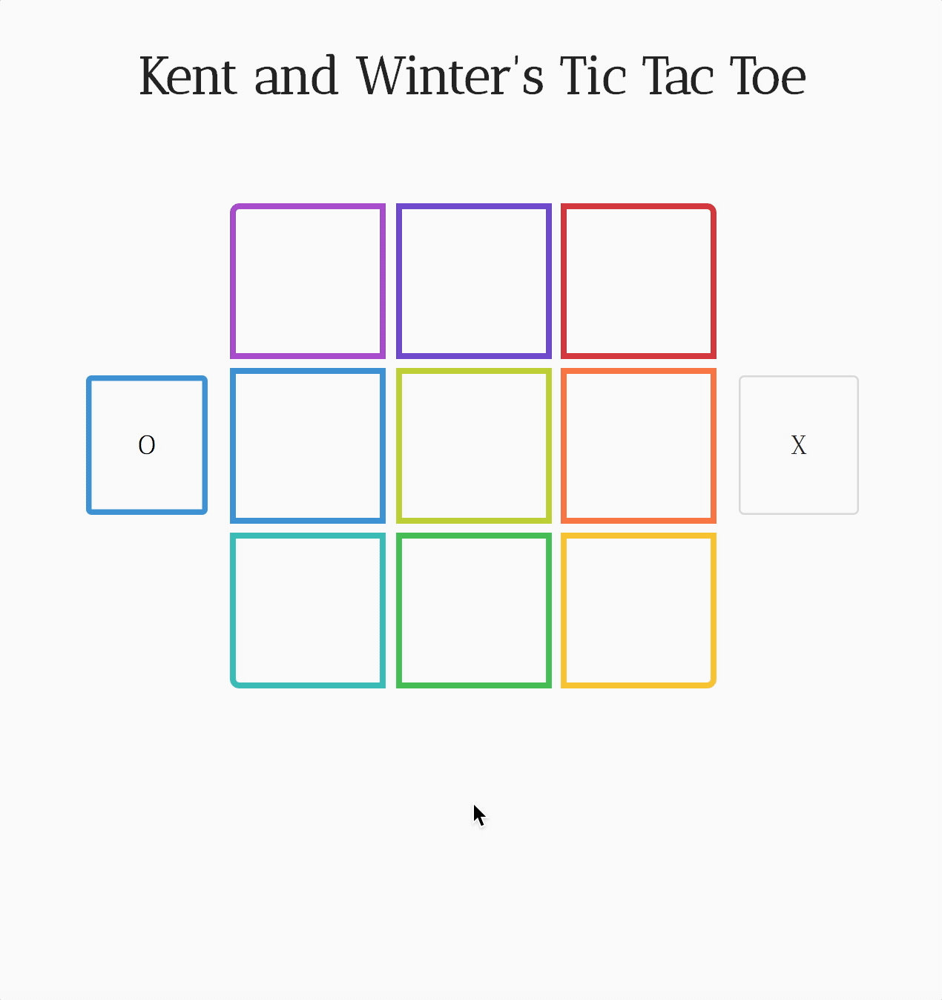

# Rainbow Tic Tac Toe

#### _A responsive tic tac toe game, built with Flexbox and CSS Grid. 2.16.2020_

#### By **Winter A. Runion and Kent P. McKinney**

## Description 
A tic-tac-toe game for two players.

## Demo
Play online at [wrunion.github.io/rainbow-tic-tac-toe](https://wrunion.github.io/rainbow-tic-tac-toe/)

  

### Technologies Used
* HTML, CSS, JavaScript
* jQuery
* [Semantic UI](https://semantic-ui.com/)

### Known Bugs
* None 

### Contact

If you have questions or comments you can reach me at winter@winterrunion.com

### License
_This software is licensed under the MIT license._

_Copyright (c) 2020 **Winter A. Runion, Kent P. McKinney**_
